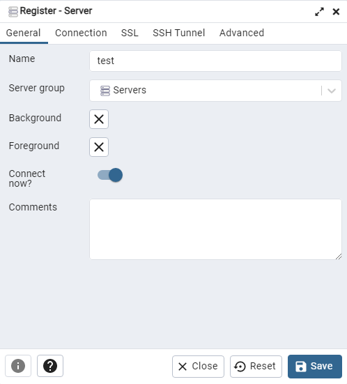
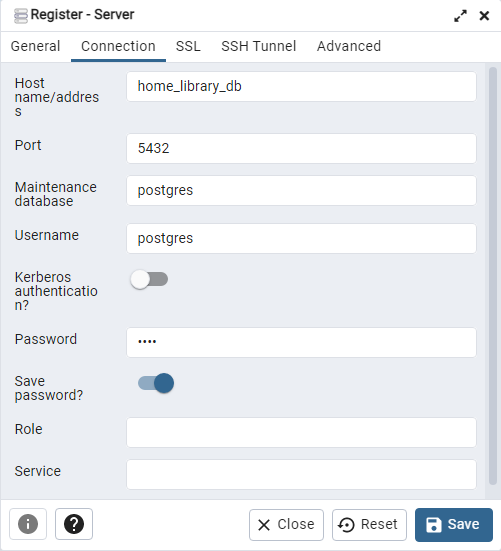

# Home Library Service

### Prerequisites
- Git - [Download & Install Git](https://git-scm.com/downloads).
- Node.js - [Download & Install Node.js](https://nodejs.org/en/download/) and the npm package manager.

### Downloading
```
git clone https://github.com/petro1909/nodejs2023Q2-service.git
```
### Go to task development branch
```
git checkout develop_2
```
# Local run
#### Installing NPM modules
```
npm install
```
#### Running application
```
npm run start
```
or with dev
```
npm run start:dev
```
# Docker run 
Docker compose file use three images - app, postgres and pgadmin4.
To run all images via docker you should open terminal in project folder and run one of the following commands:
```
docker compose up
```
**build images locally**
```
docker compose up --build
```
**run in detached mode**
```
docker compose up --detach
```

# Use pgadmin
Pgadmin is postgresql administration and development platform.

To use pgadmin in docker, after containers start, you should enter http://localhost:80 in browser, then enter postgres email and password that provided in .env.docker file as "PGADMIN_DEFAULT_EMAIL" and "PGADMIN_DEFAULT_PASSWORD".

Then you need to register server with our database in container
* Name - can be any<br>

* Host name/address - name of container (home_library_db)
* Port, Username, Password - provided in .env.docker file<br>



# Scanning vulnerabilities
To scan app service vulnerabilities use script
```
npm run scan
```

# Testing
* To test on you local machine after application running open new terminal and enter one of test commnads.
* To test on docker desktop after container start open container with app, push terminal button and enter one of test commnads.
* To test in docker terminal you should start app in detach mode,
then run command
    ```
    docker-compose exec app sh
    ```
    to enter app terminal and enter one of test commnads.
### Test commands
To run all tests without authorization
```
npm run test
```
To run only one of all test suites
```
npm run test -- <path to suite>
```
To run all test with authorization
```
npm run test:auth
```
To run only specific test suite with authorization
```
npm run test:auth -- <path to suite>
```

# Documentation
After starting the app on port (4000 as default) you can open
in your browser OpenAPI documentation by typing http://localhost:port/doc/.
For more information about OpenAPI/Swagger please visit https://swagger.io/.

# Auto-fix and format
```
npm run lint
```
```
npm run format
```

# Debugging in VSCode
Press <kbd>F5</kbd> to debug.
For more information, visit: https://code.visualstudio.com/docs/editor/debugging
